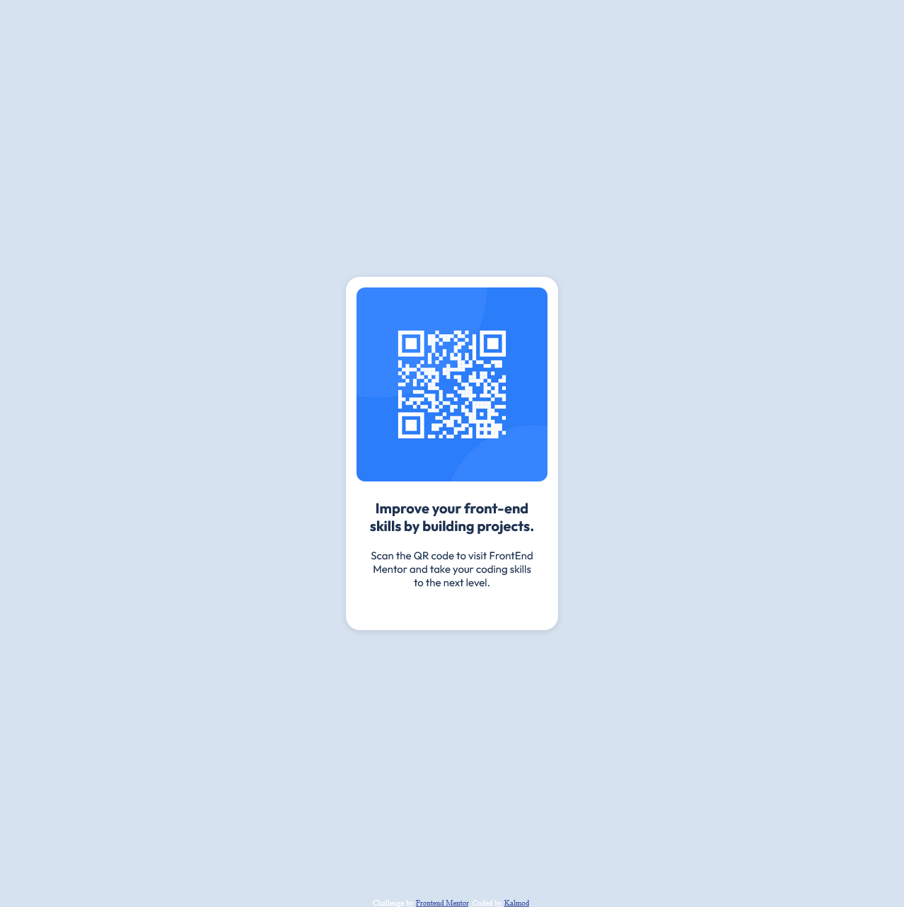

# Frontend Mentor - QR code component solution

This is a solution to the [QR code component challenge on Frontend Mentor](https://www.frontendmentor.io/challenges/qr-code-component-iux_sIO_H). Frontend Mentor challenges help you improve your coding skills by building realistic projects. 

## Table of contents

- [Overview](#overview)
  - [Screenshot](#screenshot)
  - [Links](#links)
- [My process](#my-process)
  - [Built with](#built-with)
  - [What I learned](#what-i-learned)
  - [Continued development](#continued-development)
  - [Useful resources](#useful-resources)
- [Author](#author)
- [Acknowledgments](#acknowledgments)

**Note: Delete this note and update the table of contents based on what sections you keep.**

## Overview

### Screenshot

### Links

- Solution URL: [GitHub Page](https://github.com/kalmod/frontendmentor_qr-code-component)
- Live Site URL: [Link](https://kalmod.github.io/frontendmentor_qr-code-component)

## My process

### Built with

- CSS custom properties
- Flexbox
- CSS Grid

### What I learned

While I didn't learn much, this was a useful project to help with reinforincing my current knoweldge. 

### Continued development

- Box shadow.
- Flex propreties, mainly:
  - Flex-Grow
  - Flex-Shrink
  - Flex-basis
- Aspect Ratio

### Useful resources

- [Aspect Ratio Article](https://css-tricks.com/almanac/properties/a/aspect-ratio/)
- [CSS Box-Shadow Examples](https://getcssscan.com/css-box-shadow-examples) - Huge help with getting a box shadow close to the design image.

## Author

- Frontend Mentor - [@kalmod](https://www.frontendmentor.io/profile/kalmod)

## Acknowledgments
